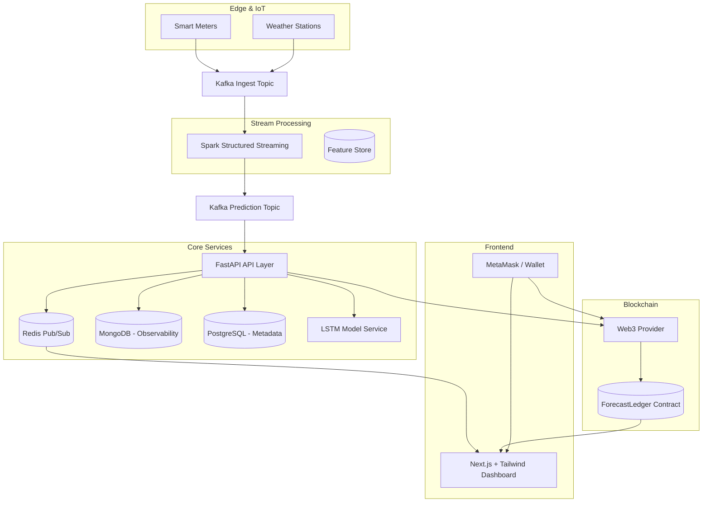
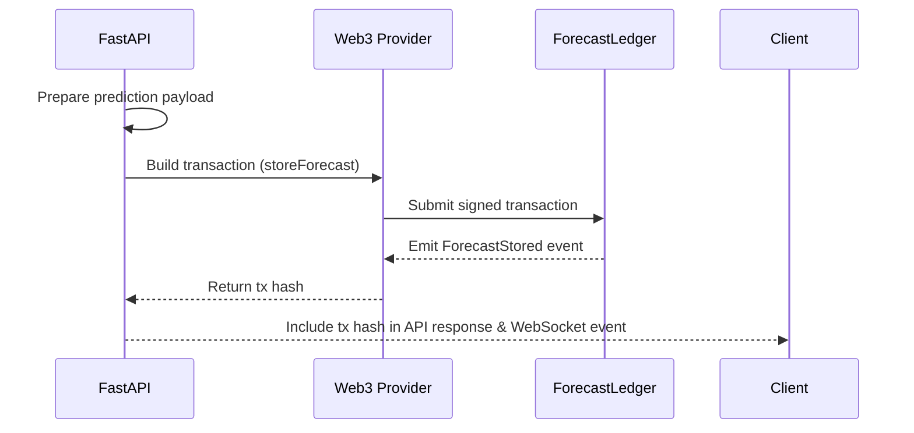
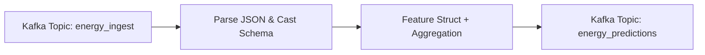

# Decentralized Energy Forecasting — System Architecture

## High-level Architecture


## Component Overview
- **Data Producers**: Edge devices publish telemetry to Kafka (`energy_ingest`).
- **Spark Streaming**: Cleanses, enriches, and aggregates telemetry, emitting prediction-ready payloads to `energy_predictions`.
- **FastAPI Backend**: Exposes REST & WebSocket APIs, orchestrates model inference, persists analytics, forwards events to Redis, and notarizes forecasts on-chain.
- **Model Service**: PyTorch LSTM loaded in-process for low-latency inference.
- **Datastores**: MongoDB (timeseries analytics), PostgreSQL (metadata/config), Redis (real-time fan-out).
- **Blockchain**: ForecastLedger smart contract (Solidity) immutably stores forecast proofs.
- **Frontend**: Next.js dashboard with live charts, wallet auth, and analytics exploration.
- **CI/CD & Ops**: Docker images, GitHub Actions pipeline, Kubernetes manifests for production rollout.

## Data Flow
1. Telemetry enters Kafka (`energy_ingest`).
2. Spark Structured Streaming parses and aggregates event windows, emitting cleansed payloads to Kafka (`energy_predictions`).
3. FastAPI worker consumes `energy_predictions`, triggers LSTM inference, publishes real-time updates to Redis, persists metrics to Mongo/Postgres, and records results on-chain.
4. Frontend subscribes via WebSocket to Redis bridge, fetches REST analytics for historical insights, and displays blockchain verification state.

## Microservices Structure
- **FastAPI API** (`backend/app`): REST, WebSocket, inference orchestration.
- **Spark Streaming Job** (`spark_pipeline/streaming_job.py`): Continuous ETL & feature engineering.
- **Kafka Consumer Worker** (`backend/app/workers/kafka_consumer.py`): Bridges streaming predictions to Redis/web clients.
- **Blockchain Subsystem** (`blockchain/`): Hardhat project housing ForecastLedger contract and deployment scripts.

## Blockchain Integration Workflow


## Real-time Spark Streaming Pipeline


## FastAPI Surface
- `GET /api/v1/health` — heartbeat.
- `POST /api/v1/predictions` — synchronous prediction request + blockchain notarization.
- `GET /api/v1/analytics/kpis` — aggregated KPIs.
- `GET /api/v1/analytics/predictions` — rolling forecast history.
- `WS /api/v1/stream` — live forecast push channel.

## Model Inference Flow
1. API receives feature window (`FeatureVector`).
2. Payload normalized & converted to tensor.
3. PyTorch LSTM executes forward pass.
4. Result packaged with metadata + version.
5. Blockchain transaction optional (if credentials configured).
6. Response returned & broadcast over WebSocket.

## Deployment Architecture
```mermaid
graph TD
    subgraph CI/CD
        gha[GitHub Actions]
    end
    subgraph Registry
        ghcr[Container Registry]
    end
    subgraph Prod Cluster (Kubernetes)
        fe[Frontend Deployment]
        api[Backend Deployment]
        sparkjob[Spark Streaming Job]
        ds[Mongo/Postgres/Redis/Kafka]
    end

    gha -->|Build & Test| gha
    gha -->|Push Images| ghcr
    ghcr --> fe
    ghcr --> api
    gha -->|Apply Manifests| Prod Cluster
    api --> ds
    sparkjob --> ds
    fe --> api
    api -->|On-chain| ledger[(Ethereum/Hyp.)]
```

## CI/CD Overview
- **Lint & Test**: PR pipeline runs `npm test`, `npm run lint`, `pytest`.
- **Build**: Docker images for frontend/backend pushed to registry.
- **Deploy**: GitOps (ArgoCD/Flux) or `kubectl` apply of manifests.

